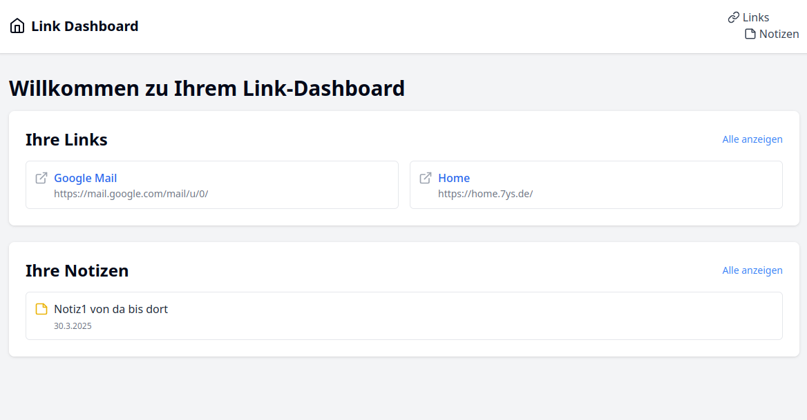
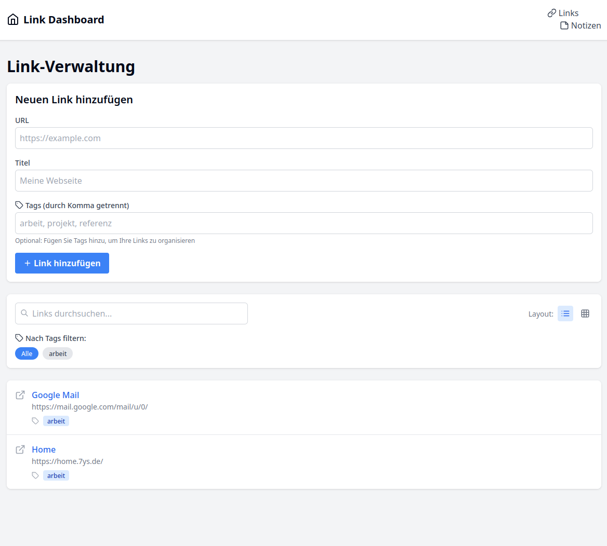
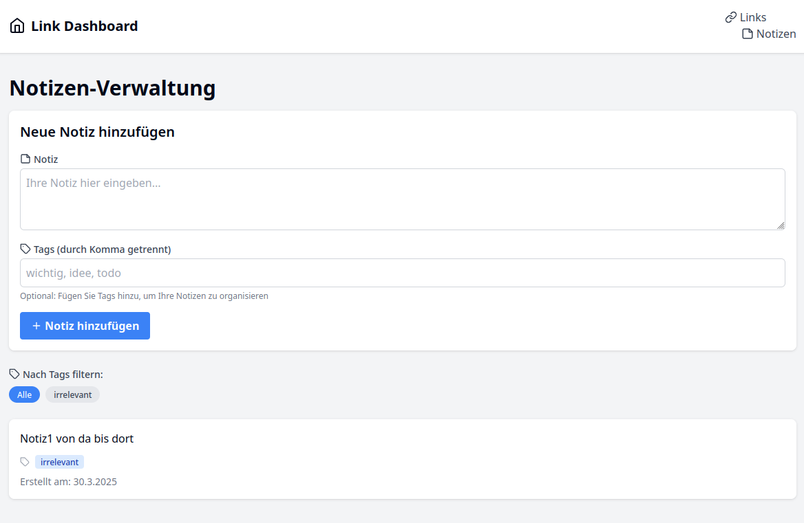

# LinkDashboard-yx

Eine Web-Anwendung zur Verwaltung von Links, Bookmarks und Notizen mit einem personalisierten Dashboard.

<h4 align="center"><i>Currently in development – feedback & contributions welcome!</i></h4>



## Funktionen

### Hauptfunktionen
- **Link-Dashboard**: Erstellen Sie ein personalisiertes Dashboard mit Ihren wichtigsten Links
- **Bookmark-Manager**: Speichern und organisieren Sie Ihre Webseiten-Lesezeichen
- **Notizen**: Erstellen und verwalten Sie einfache Notizen

### Zusatzfunktionen (geplant)
- Tagging-System für Links und Notizen
- Verschiedene Layoutoptionen (Grid, Listenansicht)
- Durchsuchbare und filterbare Benutzeroberfläche
- Gruppierung von Links und Notizen nach Themen oder Projekten

## Technologien

- **Frontend**: Next.js, React, Tailwind CSS
- **UI-Komponenten**: Radix UI, Lucide React Icons
- **Backend**: Next.js API Routes
- **Datenbank**: SQLite mit Prisma ORM

## Installation

1. Repository klonen
   ```bash
   git clone [repository-url]
   cd my-link-dashboard
   ```

2. Abhängigkeiten installieren
   ```bash
   npm install
   ```

3. Datenbank initialisieren
   ```bash
   npx prisma migrate dev
   ```

4. Entwicklungsserver starten
   ```bash
   npm run dev
   ```

5. Öffnen Sie [http://localhost:3000](http://localhost:3000) in Ihrem Browser

## Verwendung

### Links verwalten
- Navigieren Sie zur Seite "Links"
- Fügen Sie neue Links mit URL und Titel hinzu
- Alle gespeicherten Links werden in einer Liste angezeigt

### Notizen verwalten
- Funktion in Entwicklung

## Screenshots

### Dashboard


### Links-Verwaltung


### Notizen-Ansicht


## Projektstruktur

```
my-link-dashboard/
├── components/         # React-Komponenten
│   ├── Dashboard.js    # Dashboard-Komponente
│   ├── Layout.js       # Layout-Wrapper
│   ├── LinkForm.js     # Formular zum Hinzufügen von Links
│   ├── LinkList.js     # Komponente zur Anzeige von Links
│   └── Navbar.js       # Navigationsleiste
├── lib/                # Hilfsfunktionen und Bibliotheken
│   ├── db.js           # Datenbankhelfer
│   └── prisma.js       # Prisma-Client-Konfiguration
├── pages/              # Next.js-Seiten
│   ├── index.js        # Startseite
│   ├── links.js        # Link-Verwaltungsseite
│   └── api/            # API-Endpunkte
│       ├── links.js    # Links API
│       └── notes.js    # Notizen API
└── prisma/             # Prisma-Konfiguration und Migrationen
    ├── schema.prisma   # Datenbankschema
    └── migrations/     # Datenbank-Migrationen
```

## API-Endpunkte

### Links API
- `GET /api/links` - Alle Links abrufen
- `POST /api/links` - Neuen Link erstellen

### Notizen API
- `GET /api/notes` - Alle Notizen abrufen
- `POST /api/notes` - Neue Notiz erstellen

## Entwicklungspläne

- Implementierung des Tagging-Systems
- Hinzufügen von verschiedenen Layoutoptionen
- Entwicklung der Such- und Filterfunktionalität
- Implementierung der Gruppierungsfunktion für Links und Notizen

## Lizenz

[Ihre Lizenz hier]
