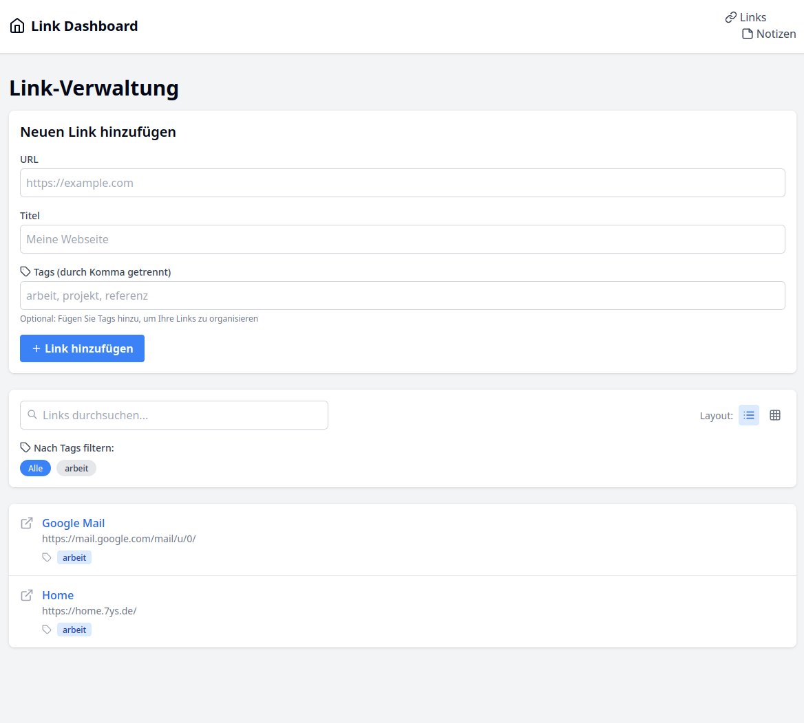
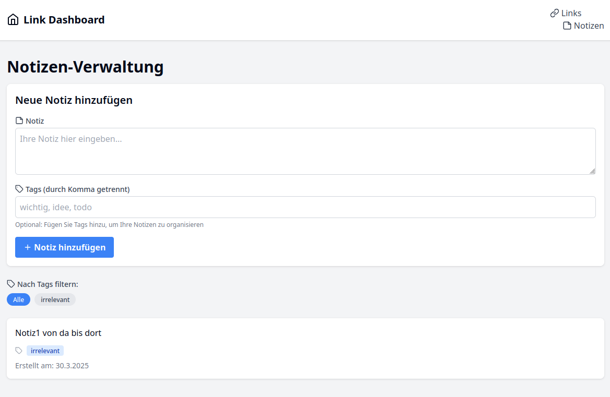

# LinkDashboard-yx

*A web app to manage links, bookmarks, and notes in a personalized dashboard.*

<h4 align="center"><i>Currently in development – feedback & contributions welcome!</i></h4>

<p align="center">
  
</p>

---

## 🚀 Features

### Core Functionality
- 📌 **Link Dashboard** – Create your own dashboard with essential links
- 🔖 **Bookmark Manager** – Save and organize web bookmarks
- 🗒️ **Notes** – Simple note management (in progress)

### Upcoming Enhancements
- 🏷️ Tagging system for links and notes  
- 🧩 Multiple layout modes (grid, list)  
- 🔍 Searchable and filterable interface  
- 📁 Grouping by topic or project

---

## 🛠️ Tech Stack

- **Frontend**: Next.js, React, Tailwind CSS  
- **UI Components**: Radix UI, Lucide React Icons  
- **Backend**: Next.js API Routes  
- **Database**: SQLite with Prisma ORM

---

## ⚙️ Installation

```bash
# 1. Clone the repository
git clone [repository-url]
cd my-link-dashboard

# 2. Install dependencies
npm install

# 3. Initialize database
npx prisma migrate dev

# 4. Start development server
npm run dev
```

Then open [http://localhost:3000](http://localhost:3000) in your browser.

---

## 🧑‍💻 Usage

### Manage Links
- Go to the **Links** page
- Add new links with title and URL
- All saved links appear in a list view

### Manage Notes
- Currently under development

---

## 📸 Screenshots

**Dashboard View**
<p align="center">
  
</p>

**Link Management**
<p align="center">
  
</p>

**Notes View**
<p align="center">
  
</p>

---

## 🗂️ Project Structure

```
my-link-dashboard/
├── components/         # React components
│   ├── Dashboard.js
│   ├── Layout.js
│   ├── LinkForm.js
│   ├── LinkList.js
│   └── Navbar.js
├── lib/                # Utilities and helpers
│   ├── db.js
│   └── prisma.js
├── pages/              # Next.js pages
│   ├── index.js
│   ├── links.js
│   └── api/
│       ├── links.js
│       └── notes.js
└── prisma/             # Prisma config and migrations
    ├── schema.prisma
    └── migrations/
```

---

## 📡 API Endpoints

### Links API
- `GET /api/links` – Fetch all links  
- `POST /api/links` – Create a new link

### Notes API
- `GET /api/notes` – Fetch all notes  
- `POST /api/notes` – Create a new note

---

## 🧭 Roadmap

- Implement tag system  
- Add multiple layout options  
- Develop search & filter functionality  
- Add grouping support for links and notes

---

## 📄 License


